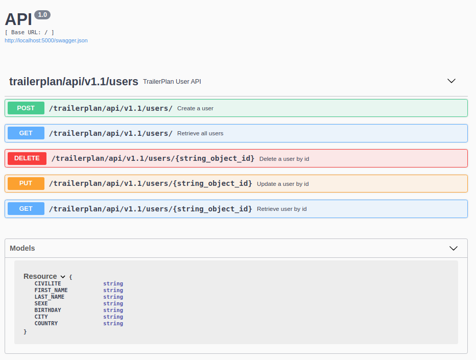

TRAILER PLAN DATABASE WITH MONGO
================================

This is the database in mongodb for the project TRAILERPLAN in https://github.com/boonsuli/trailerpplan-user.
It use docker compose to launch 3 containers docker with mongodb 3.6.22, the client mongo express 0.54.0 and an CRUD python app.
The mongodb initialized with data and it will be request with a swagger at http://localhost:5000.



Prerequisite : docker, docker-compose, python ;-)

In the root dir of the project :
```shell script
docker-compose --env-file ./config/env.dev --log-level debug up --build
```
this command specify : 
 - the config file in order to fill the parameters in docker compose and the script shell
 - log level to debug to increase verbosity of the logs
 - up, start the container
 - --build, to build the container in each time

It will download from docker hub in local repository the docker image if it is missing. 
Running logs at startup
```shell script
$ docker logs mongodb
2021-02-26T14:52:42.337+0000 I CONTROL  [initandlisten] MongoDB starting : pid=1 port=27017 dbpath=/data/db 64-bit host=mongodb
2021-02-26T14:52:42.337+0000 I CONTROL  [initandlisten] db version v3.6.22
2021-02-26T14:52:42.337+0000 I CONTROL  [initandlisten] git version: 62d9f36d148e4dacfec1ca8fcb110f1cc410336f
2021-02-26T14:52:42.337+0000 I CONTROL  [initandlisten] OpenSSL version: OpenSSL 1.0.2g  1 Mar 2016
2021-02-26T14:52:42.337+0000 I CONTROL  [initandlisten] allocator: tcmalloc
2021-02-26T14:52:42.337+0000 I CONTROL  [initandlisten] modules: none
2021-02-26T14:52:42.337+0000 I CONTROL  [initandlisten] build environment:
2021-02-26T14:52:42.337+0000 I CONTROL  [initandlisten]     distmod: ubuntu1604
2021-02-26T14:52:42.337+0000 I CONTROL  [initandlisten]     distarch: x86_64
2021-02-26T14:52:42.337+0000 I CONTROL  [initandlisten]     target_arch: x86_64
2021-02-26T14:52:42.337+0000 I CONTROL  [initandlisten] options: { net: { bindIpAll: true }, security: { authorization: "enabled" } }
2021-02-26T14:52:42.338+0000 I -        [initandlisten] Detected data files in /data/db created by the 'wiredTiger' storage engine, so setting the active storage engine to 'wiredTiger'.
2021-02-26T14:52:42.338+0000 I STORAGE  [initandlisten] 
2021-02-26T14:52:42.338+0000 I STORAGE  [initandlisten] ** WARNING: Using the XFS filesystem is strongly recommended with the WiredTiger storage engine
2021-02-26T14:52:42.338+0000 I STORAGE  [initandlisten] **          See http://dochub.mongodb.org/core/prodnotes-filesystem
2021-02-26T14:52:42.338+0000 I STORAGE  [initandlisten] wiredtiger_open config: create,cache_size=15350M,cache_overflow=(file_max=0M),session_max=20000,eviction=(threads_min=4,threads_max=4),config_base=false,statistics=(fast),compatibility=(release="3.0",require_max="3.0"),log=(enabled=true,archive=true,path=journal,compressor=snappy),file_manager=(close_idle_time=100000),statistics_log=(wait=0),verbose=(recovery_progress),
2021-02-26T14:52:42.823+0000 I STORAGE  [initandlisten] WiredTiger message [1614351162:823867][1:0x7f679996ea40], txn-recover: Main recovery loop: starting at 37/4736
2021-02-26T14:52:42.879+0000 I STORAGE  [initandlisten] WiredTiger message [1614351162:879456][1:0x7f679996ea40], txn-recover: Recovering log 37 through 38
2021-02-26T14:52:42.912+0000 I STORAGE  [initandlisten] WiredTiger message [1614351162:912376][1:0x7f679996ea40], txn-recover: Recovering log 38 through 38
2021-02-26T14:52:42.939+0000 I STORAGE  [initandlisten] WiredTiger message [1614351162:939327][1:0x7f679996ea40], txn-recover: Set global recovery timestamp: 0
2021-02-26T14:52:42.961+0000 I FTDC     [initandlisten] Initializing full-time diagnostic data capture with directory '/data/db/diagnostic.data'
2021-02-26T14:52:42.961+0000 I NETWORK  [initandlisten] listening via socket bound to 0.0.0.0
2021-02-26T14:52:42.961+0000 I NETWORK  [initandlisten] listening via socket bound to /tmp/mongodb-27017.sock
2021-02-26T14:52:42.961+0000 I NETWORK  [initandlisten] waiting for connections on port 27017
```

In the logs of mongodb startup there is an warning about XFS file system. I'm not going to talk about this part here.
```shell script
2021-02-23T20:56:22.397+0000 I STORAGE  [initandlisten] ** WARNING: Using the XFS filesystem is strongly recommended with the WiredTiger storage engine
2021-02-23T20:56:22.397+0000 I STORAGE  [initandlisten] **          See http://dochub.mongodb.org/core/prodnotes-filesystem
``` 


```shell script
$ docker logs mongo-express
```


```shell script
$ docker logs app_python
 * Serving Flask app "UserModule" (lazy loading)
 * Environment: development
 * Debug mode: on
2021-02-26 14:52:42,516  * Running on http://0.0.0.0:5000/ (Press CTRL+C to quit)
2021-02-26 14:52:42,517  * Restarting with stat
2021-02-26 14:52:42,703  * Debugger is active!
2021-02-26 14:52:42,704  * Debugger PIN: 180-497-932
```

```shell script
$ sudo systemctl status docker
● docker.service - Docker Application Container Engine
     Loaded: loaded (/lib/systemd/system/docker.service; enabled; vendor preset: enabled)
     Active: active (running) since Fri 2021-02-26 09:23:15 CET; 6h ago
TriggeredBy: ● docker.socket
       Docs: https://docs.docker.com
   Main PID: 1095 (dockerd)
      Tasks: 46
     Memory: 241.1M
     CGroup: /system.slice/docker.service
             ├─ 1095 /usr/bin/dockerd -H fd:// --containerd=/run/containerd/containerd.sock
             ├─49500 /usr/bin/docker-proxy -proto tcp -host-ip 0.0.0.0 -host-port 5000 -container-ip 192.168.96.2 -container-port 5000
             ├─49514 /usr/bin/docker-proxy -proto tcp -host-ip 0.0.0.0 -host-port 27017 -container-ip 192.168.96.3 -container-port 27017
             └─49758 /usr/bin/docker-proxy -proto tcp -host-ip 0.0.0.0 -host-port 8081 -container-ip 192.168.96.4 -container-port 8081
...
```


Inside the container :
```shell script
$ docker exec -it 'CONTAINER ID' bash
mongodb@mongodb:/$ mongo --username root --password P@55w*rD
MongoDB shell version v3.6.22
connecting to: mongodb://127.0.0.1:27017/?gssapiServiceName=mongodb
Implicit session: session { "id" : UUID("bfd7ab1d-0955-4c69-9489-130bf285c60d") }
MongoDB server version: 3.6.22
Welcome to the MongoDB shell.
```


docker pull mongo:4.4.3
docker pull mongo-express:0.54.0 


docker network create --driver bridge mongo-network
docker run --name db-mongo -d mongo:4.2
mongodb


docker-compose --env-file ./config/.env.dev up -d
docker-compose --env-file ./config/.env.dev up


docker run -p 27017:27017 -v /var/lib/mongodb/data/db/:/data/db  --name db-mongodb mongo:3.4.22

docker run -p 27017:27017
-v ./docker/mongodb/mongod.conf:/etc/mongod.conf \
-v ./docker/mongodb/initdb.d/:/docker-entrypoint-initdb.d/ \
-v /var/lib/mongodb/data/db/:/data/db \ 
-v /var/lib/mongodb/data/log/:/var/log/mongodb/ \
--hostname mongodb-server --name db-mongodb \  
--config /etc/mongod.conf --wiredTigerCacheSizeGB 1 \ 
mongo:4.2.12-bionic


docker run -p 27017:27017 -v `pwd`/docker/mongodb/mongod.conf:/etc/mongod.conf -v `pwd`/docker/mongodb/initdb.d/:/docker-entrypoint-initdb.d/ 
-v /var/lib/mongodb/data/db/:/data/db -v /var/lib/mongodb/data/log/:/var/log/mongodb/ 
--hostname mongodb-server --name db-mongodb --config /etc/mongod.conf --wiredTigerCacheSizeGB 1  mongo:4.2.12-bionic

$ docker exec -it <container-name> bash


https://www.docker.com/blog/containerized-python-development-part-1/
https://linuxhint.com/setup_mongodb_server_docker/
https://www.bmc.com/blogs/mongodb-docker-container
https://runnable.com/docker/python/docker-compose-with-flask-apps
https://www.cloudbees.com/blog/using-docker-compose-for-python-development/